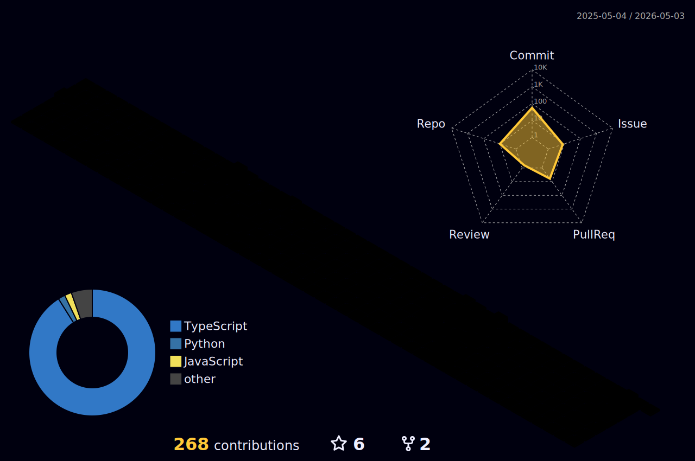

  

  
   
  

  
Contact me! 📭

 
 

   
	  <source media="(prefers-color-scheme: dark)"  srcset="https://raw.githubusercontent.com/LucasLevingston/LucasLevingston/output-3d-contrib/night.svg" />

  

<!-- 

 

<b>Visitors Count</b>
  

 

  -->

<picture align="center">
  <source media="(prefers-color-scheme: dark)" srcset="https://raw.githubusercontent.com/LucasLevingston/LucasLevingston/output/github-contribution-grid-snake-dark.svg">
  <source media="(prefers-color-scheme: light)" srcset="https://raw.githubusercontent.com/LucasLevingston/LucasLevingston/output/github-contribution-grid-snake-dark.svg">
  
</picture>

