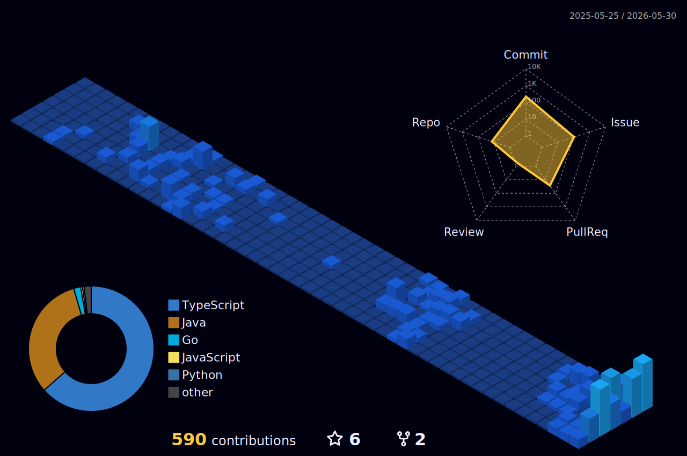

<!-- Header animado -->

<!-- Typing animado -->

 

<!-- Badges de contato -->

---

## Sobre mim

Sou desenvolvedor Full-Stack com **3 anos de experiência**, graduado em **Ciência da Computação** pela Universidade Estadual da Paraíba e cursando pós-graduação em **Desenvolvimento Web**.

- Localizado em **Patos, Paraíba, Brasil**
- Focado em **Next.js**, **TypeScript** e arquiteturas escaláveis
- Sempre aprendendo e construindo produtos reais

---

## Stack principal

### Frontend

### Backend

### Banco de Dados

### DevOps & Ferramentas

---

## Projetos em destaque

### 🏥 Consulta Fácil — Plataforma SaaS de saúde

<table>
<tr>

<td width="50%" valign="top">

#### [consulta-facil](https://github.com/LucasLevingston/consulta-facil) — Frontend
Plataforma SaaS de agendamento de consultas médicas com fluxo completo para pacientes e médicos. Autenticação, painel de controle e integração com API via Orval + OpenAPI.

`Next.js` `TypeScript` `Prisma` `Shadcn/ui` `Tailwind` `Docker` `Vitest`

🌐 [consulta-facil-next.vercel.app](https://consulta-facil-next.vercel.app)

</td>

<td width="50%" valign="top">

#### [consulta-facil-api](https://github.com/LucasLevingston/consulta-facil-api) — Backend
API REST da plataforma Consulta Fácil. Gerencia autenticação, agendamentos, assinaturas, upload de arquivos via S3 e pipelines CI/CD automatizados com GitHub Actions.

`Java` `Spring Boot` `PostgreSQL` `Docker` `AWS S3` `GitHub Actions`

</td>

</tr>
</table>

---

### 🏛️ ExpertGP — Sistema de Controle para Municípios

<table>
<tr>

<td width="50%" valign="top">

#### [ExpertGP](https://github.com/LucasLevingston/ExpertGP) — Frontend
Plataforma completa de gestão para prefeituras com interface intuitiva e responsiva. Gerencia programas, indicadores, funcionários e recursos públicos com experiência de usuário excepcional.

`TypeScript` `React` `Vite` `Zustand` `Tailwind` `Shadcn/ui` `Vitest`

</td>

<td width="50%" valign="top">

#### [ExpertGP API](https://github.com/LucasLevingston/ExpertGP_API) — Backend
API performática para o sistema de gestão municipal. Arquitetura orientada a serviços com rotas tipadas, containerização e banco relacional.

`TypeScript` `Node.js` `Fastify` `Prisma` `PostgreSQL` `Docker`

</td>

</tr>
</table>

---

## GitHub Stats

 

---

## Commits (3D)

---

## Contribuições

---

**Aberto a oportunidades e colaborações — pode entrar em contato!**

